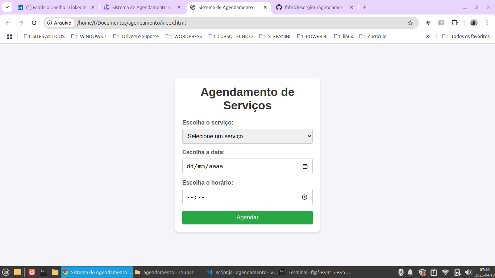

# Sistema de Agendamento de Serviços

Interface simples para agendamento de serviços com seleção de data e horário.

Clonar o Repositório

### Pré-requisitos:
- [Git instalado](https://git-scm.com/downloads) na sua máquina
- Conta no GitHub (ou outro serviço de hospedagem)
- Acesso ao repositório (público ou permissões se for privado)
- Execute o comando git clone https://github.com/fabriciosergioC/agendamento.git
- Abra o arquivo no seu computador index.html

## Funcionalidades Principais

- ✅ Seleção de serviço (dropdown)
- 📅 Escolha de data (formato dd/mm/aaaa)
- ⏰ Seleção de horário disponível
- ✔️ Botão de confirmação

## Como Usar

1. Selecione um serviço na lista suspensa
2. Escolha a data desejada
3. Selecione um horário disponível
4. Clique em "Agendar" para confirmar
